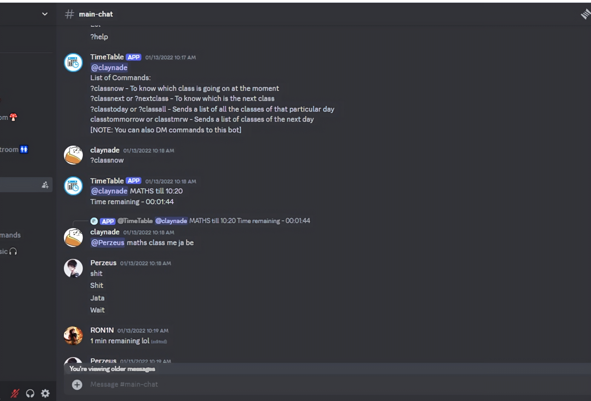

# Class Schedule Manager Bot

## Overview

ClassScheduleBot is a Discord bot designed to help you and your friends keep track of your online class schedule. It displays the current period and the upcoming period during online classes. This bot is especially useful for those who frequently ask, "Which is the next period?" during their chill sessions on Discord.

## Features

- **Current Period Display**: Shows the current class period.
- **Next Period Display**: Indicates which class period is coming up next.
- **Real-Time Updates**: Automatically updates as time progresses.
- **Easy Integration**: Simple setup process to add the bot to your Discord server.

## Technologies Used

- **discord.py**: For interacting with the Discord API.
- **Python**: For the core bot logic and asynchronous programming.
- **Asyncio**: For handling asynchronous tasks and scheduling.

## Getting Started

### Prerequisites

Before you begin, ensure you have the following installed:

- Python 3.6+
- A Discord account and a Discord server where you have admin privileges

### Installation

1. **Clone the repository**

   ```bash
   git clone https://github.com/your-username/ClassScheduleBot.git
   cd ClassScheduleBot
